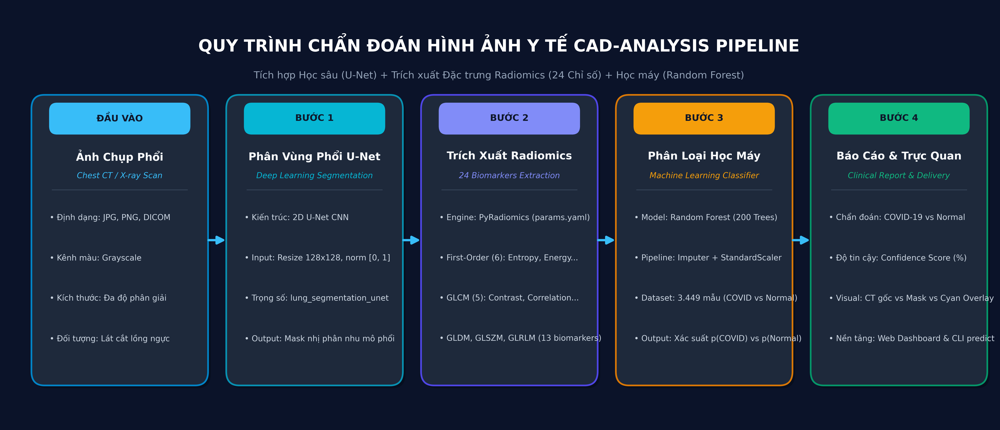
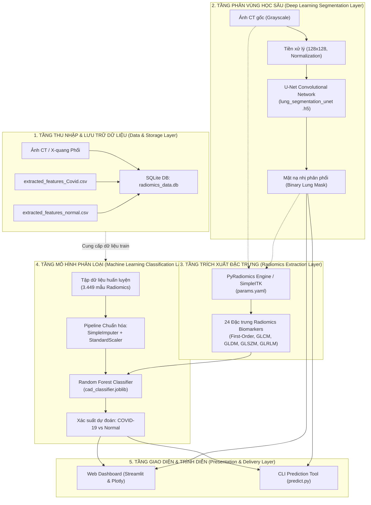
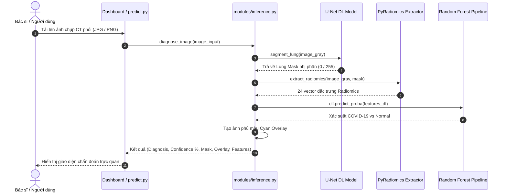

# TÀI LIỆU KIẾN TRÚC HỆ THỐNG CAD-ANALYSIS-DASHBOARD
*(System Architecture & Design Specification)*

---

## 1. Giới thiệu tổng quan (System Overview)

Hệ thống **CAD-Analysis-Dashboard** là một nền tảng chẩn đoán có sự hỗ trợ của máy tính (*Computer-Aided Diagnosis - CAD*) đa tầng, tích hợp giữa **Học sâu (Deep Learning)** trong phân vùng tổn thương ảnh y tế và **Đặc trưng học phóng xạ (Radiomics Feature Analysis)** kết hợp **Học máy (Machine Learning)** để phân loại nguy cơ nhiễm COVID-19 so với ca bệnh bình thường (Normal) từ ảnh chụp cắt lớp vi tính (CT Scan) và X-quang phổi.

Hệ thống phục vụ 2 nhóm mục đích chính:
1. **Phân tích & Nghiên cứu (EDA & Research Platform)**: Khám phá tương quan đặc trưng, kiểm định giả thuyết thống kê, giảm chiều dữ liệu PCA và đánh giá chéo các thuật toán phân loại.
2. **Chẩn đoán lâm sàng ảnh mới (Clinical Inference Engine)**: Cho phép bác sĩ/người dùng đưa ảnh chụp mới vào để tự động phân vùng phổi, trích xuất đặc trưng kết cấu và đưa ra dự đoán xác suất bệnh trong thời gian thực (< 1 giây).

---

## 2. Sơ đồ Kiến trúc Tổng thể (High-Level Architecture)





---

## 3. Chi tiết các Tầng Kiến trúc (Architectural Layers)

### 3.1. Tầng 1: Thu thập & Lưu trữ Dữ liệu (Data & Storage Layer)
- **Cơ sở dữ liệu**: SQLite (`radiomics_data.db`).
- **Bảng dữ liệu chính**: `radiomic_features`.
- **Dữ liệu nguồn**:
  - `extracted_features_Covid.csv`: 2.246 mẫu bệnh nhân dương tính COVID-19 (nhãn Target = 1).
  - `extracted_features_normal.csv`: 1.203 mẫu phổi bình thường (nhãn Target = 0).
  - Tổng số mẫu: **3.449 mẫu dữ liệu lâm sàng**.
- **Cơ chế nạp dữ liệu**: Module [`Analysis Dashboard/database_setup.py`](file:///d:/Work/Clients/A_Giap/code_review/CAD-Analysis-Dashboard/Analysis%20Dashboard/database_setup.py) tự động phân nhãn và ghi vào SQLite thông qua SQLAlchemy và kết nối SQLite thread-safe.

---

### 3.2. Tầng 2: Phân vùng phổi bằng Học sâu (Deep Learning Segmentation Layer)
- **Kiến trúc mạng**: **2D U-Net** gồm 2 nhánh:
  - *Contracting Path (Encoder)*: 5 khối Conv2D (64, 128, 256, 512, 1024 bộ lọc) kèm Max Pooling (2x2) để trích xuất ngữ cảnh.
  - *Expanding Path (Decoder)*: 4 khối Conv2DTranspose kết hợp Skip Connections để ghép nối đặc trưng không gian và khôi phục độ phân giải.
  - *Lớp đầu ra*: Conv2D với hàm kích hoạt `Sigmoid` tạo xác suất vùng phổi.
- **Kích thước tensor đầu vào**: `(Batch_Size, 128, 128, 1)` với dải giá trị chuẩn hóa `[0.0, 1.0]`.
- **Trọng số mô hình**: [`ML/UNET Training/lung_segmentation_unet .h5`](file:///d:/Work/Clients/A_Giap/code_review/CAD-Analysis-Dashboard/ML/UNET%20Training/lung_segmentation_unet%20.h5) (~372 MB).
- **Hậu xử lý**: Ngưỡng nhị phân $Threshold \ge 0.5$ tạo mask nhị phân (`{0, 255}`), sau đó nội suy đa thức bậc gần nhất (*Nearest Neighbor*) về kích thước ảnh gốc.

```
Input (H x W) ──> Resize (128x128) ──> U-Net Model ──> Output Prob Map ──> Threshold (0.5) ──> Binary Mask (H x W)
```

---

### 3.3. Tầng 3: Trích xuất Đặc trưng Phóng xạ (Radiomics Feature Engineering Layer)
Module sử dụng **PyRadiomics** và **SimpleITK** tuân thủ cấu hình định nghĩa tại [`Analysis Dashboard/params.yaml`](file:///d:/Work/Clients/A_Giap/code_review/CAD-Analysis-Dashboard/Analysis%20Dashboard/params.yaml):
- **Tham số cấu hình**:
  - `binWidth`: 25 (chia mức xám thành các khoảng đồng nhất).
  - `interpolator`: `sitkBSpline`.
  - `label`: 255 (chỉ trích xuất các pixel thuộc mặt nạ phổi do U-Net sinh ra).

#### 24 Đặc trưng Radiomics cốt lõi được trích xuất:
| Nhóm đặc trưng (Feature Class) | Số lượng | Danh sách các đặc trưng | Ý nghĩa lâm sàng |
| :--- | :---: | :--- | :--- |
| **First-Order (Cường độ bậc 1)** | 6 | `Entropy`, `Energy`, `Uniformity`, `MeanAbsoluteDeviation`, `Skewness`, `Kurtosis` | Đo lường mức độ hỗn loạn cường độ điểm ảnh, năng lượng tín hiệu và độ lệch phân phối mức xám trong nhu mô phổi. |
| **GLCM (Gray Level Co-occurrence Matrix)** | 5 | `Contrast`, `Idm`, `Correlation`, `ClusterProminence`, `ClusterShade` | Mô tả tương quan kết cấu không gian giữa các cặp pixel lân cận; phản ánh độ thô ráp và độ đồng nhất của mô kẽ. |
| **GLDM (Gray Level Dependence Matrix)** | 5 | `GrayLevelNonUniformity`, `DependenceNonUniformity`, `DependenceVariance`, `LowGrayLevelEmphasis`, `HighGrayLevelEmphasis` | Đánh giá mức độ phụ thuộc mức xám lân cận; phát hiện các mảng đông đặc và kính mờ (Ground-Glass Opacities). |
| **GLSZM (Gray Level Size Zone Matrix)** | 5 | `ZoneEntropy`, `LargeAreaEmphasis`, `SmallAreaEmphasis`, `GrayLevelVariance`, `SizeZoneNonUniformity` | Đo lường kích thước các vùng đồng nhất cường độ xám; phản ánh diện tích tổn thương dạng đốm hay dạng dải. |
| **GLRLM (Gray Level Run Length Matrix)** | 3 | `RunLengthNonUniformity`, `ShortRunEmphasis`, `LongRunEmphasis` | Phân tích độ dài vệt pixel liên tục có cùng mức xám theo các hướng góc (0°, 45°, 90°, 135°). |

---

### 3.4. Tầng 4: Phân loại Học máy (Machine Learning Classification Layer)
- **Mô hình**: **Random Forest Classifier** (`n_estimators=200`, `max_depth=15`, `class_weight='balanced'`).
- **Pipeline chuẩn hóa**:
  1. `SimpleImputer(strategy='median')`: Xử lý giá trị khuyết thiếu.
  2. `StandardScaler()`: Chuẩn hóa Z-score đưa các đặc trưng có thang đo chênh lệch lớn (ví dụ `Energy` $\sim 10^8$ và `Uniformity` $\sim 10^{-1}$) về cùng phân phối $(\mu=0, \sigma=1)$.
  3. `RandomForestClassifier`: Dự đoán phân lớp và tính toán xác suất `predict_proba`.
- **Lưu trữ mô hình**: Lưu dạng nhị phân đóng gói tại `models/cad_classifier.joblib`, cho phép tái sử dụng tức thì mà không cần huấn luyện lại.

---

### 3.5. Tầng 5: Giao diện & Trình diễn (Presentation Layer)
Hệ thống cung cấp 2 phương thức tương tác:

1. **Ứng dụng Web Tương tác ([`Analysis Dashboard/dashboard.py`](file:///d:/Work/Clients/A_Giap/code_review/CAD-Analysis-Dashboard/Analysis%20Dashboard/dashboard.py))**:
   - Xây dựng bằng **Streamlit** & **Plotly**.
   - Cung cấp 3 trang chức năng:
     - **Textual Analysis**: Báo cáo thống kê mô tả, kiểm định giả thuyết t-Test, Anderson-Darling, Kolmogorov-Smirnov, báo cáo PCA và bảng đánh giá chéo (Cross-Validation).
     - **Visual Comparisons**: Heatmap tương quan đa chiều, Box plot, QQ-plot, đồ thị ROC-AUC và biểu đồ độ quan trọng đặc trưng (Feature Importance).
     - **New Diagnosis**: Kéo thả ảnh mới để chẩn đoán lâm sàng thời gian thực.
2. **Công cụ Dòng lệnh Độc lập ([`predict.py`](file:///d:/Work/Clients/A_Giap/code_review/CAD-Analysis-Dashboard/predict.py))**:
   - Dành cho chẩn đoán đơn lẻ hoặc xử lý hàng loạt theo thư mục ảnh.
   - Tự động lưu ảnh mặt nạ (`_mask.png`), ảnh phủ màu (`_overlay.png`) và file tổng hợp kết quả (`batch_diagnosis_summary.csv`).

---

## 4. Sơ đồ Luồng Suy luận Chẩn đoán (Inference Flow Diagram)



---

## 5. Sơ đồ Cấu trúc Thư mục và File (Project Map)

```text
CAD-Analysis-Dashboard/
│
├── Analysis Dashboard/               # Tầng ứng dụng phân tích & Dữ liệu
│   ├── dashboard.py                  # Mã nguồn chính Streamlit Dashboard
│   ├── database_setup.py             # Script nạp CSV vào SQLite DB (path động)
│   ├── ex.py                         # Script kiểm tra truy vấn DB mẫu
│   ├── extracted_features_Covid.csv  # Dữ liệu đặc trưng 2.246 ca COVID
│   ├── extracted_features_normal.csv # Dữ liệu đặc trưng 1.203 ca Normal
│   ├── params.yaml                   # Cấu hình trích xuất PyRadiomics chuẩn
│   └── radiomics_data.db             # SQLite database chứa bảng radiomic_features
│
├── ML/                               # Tầng Huấn luyện Mô hình Máy học & Học sâu
│   ├── Feature Extraction/
│   │   ├── Radiomics_Anglewise_Covid.ipynb   # Trích xuất góc ảnh COVID
│   │   └── Radiomics_Anglewise_Normal.ipynb  # Trích xuất góc ảnh Normal
│   ├── Random_Classifier.ipynb               # Thử nghiệm Random Forest & SMOTE
│   └── UNET Training/
│       ├── Data Split.ipynb                  # Chia tập dữ liệu Train/Val/Test
│       ├── Unet Training.ipynb               # Huấn luyện mô hình U-Net
│       ├── Unet_new.ipynb                    # Pipeline suy luận mask U-Net
│       ├── lung_segmentation_unet .h5        # Trọng số mô hình U-Net (~372MB)
│       └── predictions.npy                   # Kết quả dự đoán mask
│
├── modules/                          # Thư viện logic xử lý cốt lõi
│   ├── eda.py                        # Các hàm tính toán thống kê, EDA, PCA
│   └── inference.py                  # Engine chẩn đoán ảnh mới End-to-End
│
├── sample_data/                      # Dữ liệu mẫu phục vụ kiểm thử
│   ├── create_sample.py              # Script sinh ảnh lát cắt CT mô phỏng
│   └── sample_chest_ct.jpg           # Ảnh lát cắt CT mẫu
│
├── models/                           # Thư mục lưu trữ mô hình đã đóng gói
│   └── cad_classifier.joblib         # Pipeline Random Forest đã train
│
├── predict.py                        # Công cụ CLI chẩn đoán ảnh mới
├── requirements.txt                  # Thư viện cho Dashboard & EDA
├── requirements-ml.txt               # Thư viện bổ sung cho Deep Learning
├── SETUP_GUIDE.md                    # Hướng dẫn cài đặt & vận hành chi tiết
├── ARCHITECTURE.md                   # Tài liệu kiến trúc hệ thống (File này)
└── README.md                         # Giới thiệu tổng quan dự án
```

---

## 6. Đánh giá Hiệu năng & Khả năng Mở rộng (Performance & Scalability)

1. **Tốc độ xử lý (Inference Latency)**:
   - Thời gian phân vùng phổi bằng U-Net: ~0.15 - 0.45 giây / lát cắt (trên CPU thông thường).
   - Thời gian trích xuất 24 đặc trưng Radiomics: ~0.2 - 0.5 giây / lát cắt.
   - Thời gian phân loại bằng Random Forest: < 0.01 giây.
   - **Tổng thời gian chẩn đoán hoàn chỉnh**: $\le \mathbf{1.0\text{ giây / ca bệnh}}$.
2. **Khả năng mở rộng (Extensibility)**:
   - Kiến trúc tách bạch giữa **Tầng phân vùng (U-Net)**, **Tầng trích xuất (PyRadiomics)** và **Tầng phân loại (Random Forest)** giúp hệ thống dễ dàng:
     - Thay thế mô hình phân vùng bằng các kiến trúc tiên tiến hơn (như *U-Net++*, *Swin-Unet*).
     - Mở rộng bài toán phân loại đa lớp (COVID-19 vs Viêm phổi do vi khuẩn vs Xơ phổi tự phát IPF vs Bình thường) chỉ bằng cách cập nhật tập nhãn huấn luyện mà không cần viết lại giao diện.
